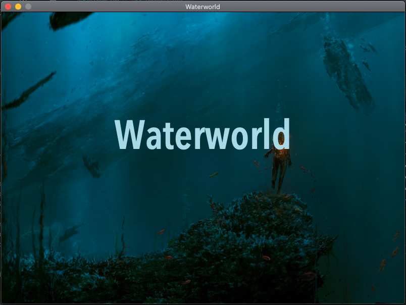

# Creating the first scene

We're going to add the first scene to the game. Yaeger supports two different
types of scenes. A `StaticScene` and a `DynamicScene`. A `StaticScene` will have
no Game World Update (GWU) and should be used for scenes in which nothing
should move or be animated. A `DynamicScene` does receive a GWU and should be
used for Game Levels, or scenes that contain animated elements. Since nothing
will have to be animated for the Title scene, it can be a `StaticScene`.

## Add the title scene

 Create a new Class called `TitleScene` that
extends `StaticScene` in the package `com.github.hanyaeger.tutorial.scenes`.
Implement the required methods, but leave them empty.

## Set the background image and audio

The method `setupScene()` should be used for setting the background image and
audio of a scene. For this you can use the methods
`setBackgroundImage(String)` and `setBackgroundAudio(String)`.

Both the image and the audio are provided in the `resources/` folder. This
folder should be the only place to store your assets. The url is relative to
this folder, so the file `background1.jpg` from the folder `backgrounds/` should
be accessed through the url `backgrounds/background1.jpg`. For the background
audio, we will use `ocean.mp3`.

 Add the following body to the `setupScene()`.

```java
@Override
public void setupScene(){
    setBackgroundAudio("audio/ocean.mp3");
    setBackgroundImage("backgrounds/background1.jpg");
}
```

At this point you should have a look at the file `module-info.java`, which is
called the [Module Descriptor](https://www.oracle.com/nl/corporate/features/understanding-java-9-modules.html).
This is a special file that defines (amongst other things) which directories
should be opened up. The `resources` folder itself is open by default, but
any subdirectory should be added for the resources in those directories to
be available. As you will notice this has already been done:

```java 
opens audio; 
opens backgrounds; 
opens sprites;
```

Do not forget to do this for your own game, or an Exception will be thrown when
the game is trying to access a resource that is in a directory that has not been
opened up.

## Add the `TitleScene` to the Yaeger game

Now that we have created the `TitleScene`, we should add it to the Game. For
this, we will use the method `addScene(int, YaegerScene)` from `Waterworld.
java`. This method should be called from `setupScenes()` and takes two
parameters. The first one identifies the scene, which you can
use to set the active scene. The second parameter is an instance of the scene.

 So add the following body to the `setupScenes()`
method:

```java
@Override
public void setupScenes(){
    addScene(0, new TitleScene());
}
```

 It's time to run the game again. After the Splash Screen
has been shown, the `TitleScene` should be loaded.

## Add some text to the `TitleScene`

Let's add the title of the game to the `TitleScene`. All objects you can add to
a scene are called *Entities*. Of these there are various different types. There
are *TextEntities* that should be used for displaying text, *SpriteEntities*
for displaying a Sprite and shape-based Entities, such as a
*RectangleEntity*. For all these types there are the Static and
Dynamic version.

A title is typically the static version of a `TextEntity`. We will use the
method `setupEntities()` to add Entities to the scene.

 Add the following body to the `setupEntities()` method:

```java
@Override
public void setupEntities(){

    var waterworldText = new TextEntity(
        new Coordinate2D(getWidth() / 2, getHeight() / 2),
        "Waterworld"
    );
    waterworldText.setAnchorPoint(AnchorPoint.CENTER_CENTER);
    waterworldText.setFill(Color.DARKBLUE);
    waterworldText.setFont(Font.font("Roboto", FontWeight.SEMI_BOLD, 80));
    addEntity(waterworldText);
}
```



First we create the `waterworldText` by instantiating a `TextEntity`. The first
parameter of the constructor is the `Coordinate2D`. To place it at the center of
the scene, we use the `getWidth()/2` and `getHeight()/2`. The second parameter
is the text to be shown. To actually place the center of the `TextEntity` at the
center of the scene, we use the method `setAnchorPoint()`. To set the color,
we use `setFill()`. We set the font to Roboto, through the
method `setFont()` and lastly we add the `TextEntity` to the scene, by
calling the method `addEntity()`.

 Run the game again. The `TitleScene` should now contain
the title.
